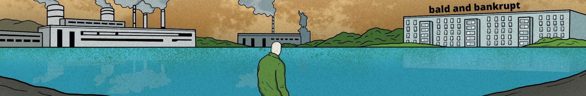
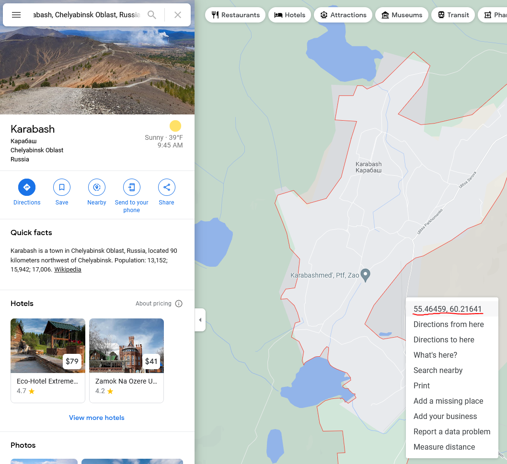

# World of Bald and Bankrupt


An interactive world map displaying the adventures of Benjamin from Bald and Bankrupt.

#### Technologies
- [Node.js](https://nodejs.org/en/)
- [Vue.js](https://vuejs.org/)
- [OpenLayers](https://openlayers.org/)
- [Mapbox](https://www.mapbox.com/)

## How to Contribute
Do you know the exact location of a video? Contribute by updating any of the map markers in the code using the steps below.

### Fork the Repository
If you don't already have a GitHub account, [start here](https://github.com/signup).

If you already have a GitHub account, fork the repository.

### Search the Items
All videos are stored in the [items.json](src/assets/items.json) file.

Use `CTRL+F` in the file using the title of the YouTube video to find it.

For example, I found the item for the video of Karabash here:
```json
{
    "snippet": {
      "publishedAt": "2019-09-08T07:51:23Z",
      "title": "KARABASH...Russia's Toxic Town",
      "description": "LATEST MERCH: https://teespring.com/en-GB/stores/bald-and-bankrupt\n🇷🇺 Not long ago the town of Karabash was declared Russia's most toxic town due got the heavy pollutants that a mining plant was pumping into the air over the region. \n\nAnd so with my friend Roman from the popular YouTube channel NFKRZ we decided to visit the town and see for ourselves just how life was progressing there. \n\nJoin us on the road to Karabash...",
      "position": 53,
      "resourceId": {
        "kind": "youtube#video",
        "videoId": "wa35Vx_07fQ"
      }
    },
    "visible": false,
    "geometry": {
      "type": "Point",
      "coordinates": [
        0,  // latitude
        0   // longitude
      ]
    }
  }
```

### Find the Coordinates
Go to [Google Maps](https://www.google.com/maps), search for the location of the video and right-click a spot and then click the latitude/longitude coordinates to copy them.



### Update the Coordinates
Update the `geometry` object, in the `coordinates` array from `0,0` to the new coordinates, like so:
```json
"geometry": {
  "type": "Point",
  "coordinates": [
    55.46974447765765,  // latitude
    60.218681676726014  // longitude
  ]
}
```

### Commit and Push the Changes
1. Add the changes using `git add .`
1. Commit the changes using `git commit -m "example comment"`
1. Push the changes using `git push`

### Create a Pull Request
Create a [pull request](https://github.com/kalyncoose/world-of-bald/pulls) from your fork to my repository.

Make sure to describe in the pull request which items you have changed and why.

## Latest Videos

### Channel Info
YouTube's internal ID's for the bald and bankrupt channel.

- **Channel ID**: `UCxDZs_ltFFvn0FDHT6kmoXA`
- **Uploads Playlist ID**: `UUxDZs_ltFFvn0FDHT6kmoXA`

### How to Obtain
To obtain the latest videos in JSON format, use the following steps:
1. Go to [YouTube API - Try It](https://developers.google.com/youtube/v3/docs/playlistItems/list#try-it)
1. For **part**, enter the value: `snippet`
1. For **maxResults**, enter the value: `20`
1. For **playlistId**, enter the value: `UUxDZs_ltFFvn0FDHT6kmoXA`
1. Under **Credentials**, ensure *Google OAuth 2.0* and *API Key* are checked
1. Click the **Execute** button
1. You should receive a `200 OK` response with a large JSON response
1. Copy the objects inside the `items` array for the latest videos

### Clean the Data
Before the new videos can be added to the [items.json](src/assets/items.json) file, you need to clean the data.

Start by removing the following fields from each object:
```json
{
    "kind": "youtube#playlistItem", // remove
    "etag": "KvpN_f101br4BiPPQmTEoJ_cqgA",  // remove
    "id": "VVV4RFpzX2x0RkZ2bjBGREhUNmttb1hBLnF1TnlpTHNlV2tn",  // remove
    "snippet": {
      "publishedAt": "2021-02-28T21:57:54Z",
      "channelId": "UCxDZs_ltFFvn0FDHT6kmoXA",  // remove
      "title": "The Ukraine You've Never Seen before 🇺🇦",
      "description": "🇺🇦 There are plenty of videos on YouTube about Ukraine and they all show the same things; pretty churches in Kyiv, beaches in Odessa or Lviv's incredible town square. But did we really learn about the country from those generic films? I don't believe so. And so I wanted to travel off the beaten track and show you the real places and meet the real people of Ukraine away from the cliches. Oh and we will search for some Soviet mosaics too. Join me on an adventure in what may well be Europe's friendliest and least understood country.",
      "thumbnails": {  // remove entire thumbnails object
        "default": {
          "url": "https://i.ytimg.com/vi/quNyiLseWkg/default.jpg",
          "width": 120,
          "height": 90
        },
        "medium": {
          "url": "https://i.ytimg.com/vi/quNyiLseWkg/mqdefault.jpg",
          "width": 320,
          "height": 180
        },
        "high": {
          "url": "https://i.ytimg.com/vi/quNyiLseWkg/hqdefault.jpg",
          "width": 480,
          "height": 360
        },
        "standard": {
          "url": "https://i.ytimg.com/vi/quNyiLseWkg/sddefault.jpg",
          "width": 640,
          "height": 480
        },
        "maxres": {
          "url": "https://i.ytimg.com/vi/quNyiLseWkg/maxresdefault.jpg",
          "width": 1280,
          "height": 720
        }
      },
      "channelTitle": "bald and bankrupt",  // remove
      "playlistId": "UUxDZs_ltFFvn0FDHT6kmoXA",  // remove
      "position": 7,
      "resourceId": {
        "kind": "youtube#video",
        "videoId": "quNyiLseWkg"
      },
      "videoOwnerChannelTitle": "bald and bankrupt",  // remove
      "videoOwnerChannelId": "UCxDZs_ltFFvn0FDHT6kmoXA"  // remove
    }
  }
```

After removing the extraneous fields, it should result in an item like this:
```json
{
    "snippet": {
      "publishedAt": "2021-02-28T21:57:54Z",
      "title": "The Ukraine You've Never Seen before 🇺🇦",
      "description": "🇺🇦 There are plenty of videos on YouTube about Ukraine and they all show the same things; pretty churches in Kyiv, beaches in Odessa or Lviv's incredible town square. But did we really learn about the country from those generic films? I don't believe so. And so I wanted to travel off the beaten track and show you the real places and meet the real people of Ukraine away from the cliches. Oh and we will search for some Soviet mosaics too. Join me on an adventure in what may well be Europe's friendliest and least understood country.",
      "position": 7,
      "resourceId": {
        "kind": "youtube#video",
        "videoId": "quNyiLseWkg"
      }
    }
  }
```

Next, add a boolean field called `visible` and an object called `geometry`:
```json
{
  "visible": false,
  "geometry": {
    "type": "Point",
    "coordinates": [
      0,
      0
    ]
  },
  "snippet": {
    "publishedAt": "2021-02-28T21:57:54Z",
    "title": "The Ukraine You've Never Seen before 🇺🇦",
    "description": "🇺🇦 There are plenty of videos on YouTube about Ukraine and they all show the same things; pretty churches in Kyiv, beaches in Odessa or Lviv's incredible town square. But did we really learn about the country from those generic films? I don't believe so. And so I wanted to travel off the beaten track and show you the real places and meet the real people of Ukraine away from the cliches. Oh and we will search for some Soviet mosaics too. Join me on an adventure in what may well be Europe's friendliest and least understood country.",
    "position": 7,
    "resourceId": {
      "kind": "youtube#video",
      "videoId": "quNyiLseWkg"
    }
  }
}
```

> Leave `visible` default to `false`, because that field handles the map marker pop-ups.

To update the `geometry` object, [follow the guide from above](#find-the-coordinates).

Finally, paste the new item object(s) to the top of the [items.json](src/assets/items.json) file.

Update the `position` field to an integer that continues where the previous item at the top of the file was.

> The `position` field is used as a key to populate the markers on the map, so there must not be any duplicates